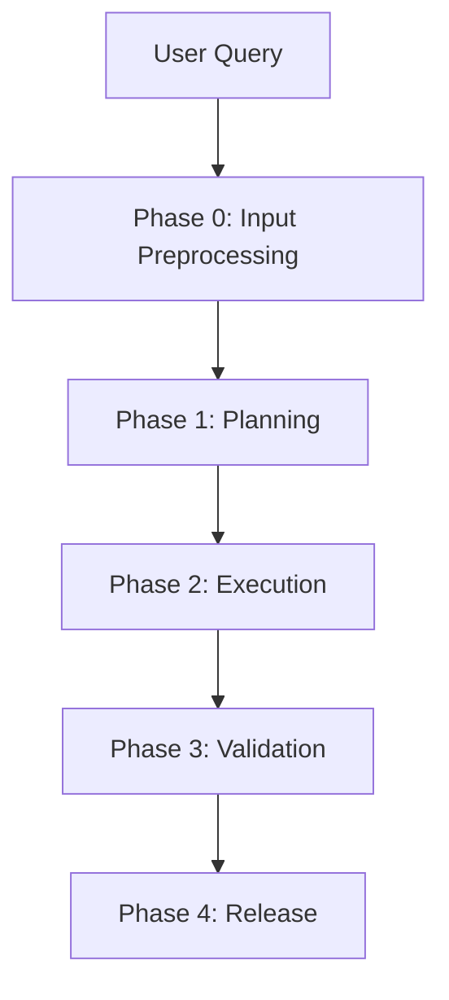

# Agent Workflow: From Intent to Release

This document defines the runtime workflow after the snapshot / event /
Libra split described in `docs/agent.md`.

## Workflow Contract

- `git-internal` snapshot objects store immutable definitions and
  revisioned structure.
- `git-internal` event objects store append-only execution facts.
- Libra owns mutable runtime state: scheduler queues, thread /
  workspace state, selected plan head, live context window, and reverse
  indexes.

The workflow must not depend on rewriting parent snapshot objects to
append runtime history.

## Phase-to-Layer Mapping

| Phase | Libra runtime / projection | Snapshot writes (`git-internal`) | Event writes (`git-internal`) |
|---|---|---|---|
| Phase 0 | Thread / Workspace setup, live context bootstrap | `Intent`, optional `ContextSnapshot` | none |
| Phase 1 | Scheduler plan selection, ready queue, checkpoints | `Plan`, `Task` | none |
| Phase 2 | live context window, staging area, retry / replan loop | `Run`, `PatchSet`, `Provenance` | `TaskEvent`, `RunEvent`, `PlanStepEvent`, `ToolInvocation`, `Evidence`, `ContextFrame`, `RunUsage` |
| Phase 3 | audit indexing, release candidate view | optional final `ContextSnapshot` | `Evidence`, `Decision`, terminal `TaskEvent` / `RunEvent` / `IntentEvent` |
| Phase 4 | review UI, current thread / workspace pointers | none | `Decision`, optional terminal `IntentEvent` |

## Workflow Overview



```text
══════════════════════════════════════════════════════════════════
 Phase 0: Input Preprocessing
 ══════════════════════════════════════════════════════════════════
 User Query
 ↓
 ├─ Extract Intent, Constraints, Quality Goals
 ├─ Identify Risk Level
 ├─ Persist Intent snapshot (immutable request / spec revision)
 ├─ Create initial ContextSnapshot if a stable baseline is needed
 └─ Initialize Libra runtime context
      - Thread / Workspace projection
      - live context window
      - reverse indexes for retrieval

══════════════════════════════════════════════════════════════════
 Phase 1: Planning
 ══════════════════════════════════════════════════════════════════
 Intent[S] + runtime context[Libra]
 ↓
 [Orchestrator Agent]
 ├─ Create Plan snapshot(s)
 │    - Plan.parents expresses replan / merge history
 │    - Plan.steps captures immutable step structure
 ├─ Create Task snapshots for delegated work units
 └─ Libra derives:
      - ready queue
      - parallel groups
      - checkpoints
      - selected plan head

══════════════════════════════════════════════════════════════════
 Phase 2: Execution
 ══════════════════════════════════════════════════════════════════
 For each ready Task / PlanStep:
 ├─ Libra prepares runtime context
 │    - load prerequisite outputs
 │    - merge selected ContextFrame records
 │    - retrieve code/docs/history
 │    - stage sandbox state
 │
 ├─ Persist Run snapshot + Provenance snapshot
 │
 ├─ Append execution facts
 │    - TaskEvent / RunEvent
 │    - PlanStepEvent
 │    - ToolInvocation
 │    - Evidence
 │    - ContextFrame
 │    - RunUsage
 │
 ├─ Persist candidate outputs as immutable PatchSet snapshots
 │
 └─ Libra maintains mutable control state
      - retry counters
      - staging area
      - batch integration state
      - replanning decisions

══════════════════════════════════════════════════════════════════
 Phase 3: Validation & Audit
 ══════════════════════════════════════════════════════════════════
 ├─ Run system-level validation and security audit
 ├─ Append Evidence / RunEvent / TaskEvent / Decision records
 ├─ Optionally persist final ContextSnapshot
 └─ Libra reconstructs release candidate and audit views from
      immutable snapshots + events

══════════════════════════════════════════════════════════════════
 Phase 4: Decision & Release
 ══════════════════════════════════════════════════════════════════
 ├─ Low risk: auto-merge
 ├─ High risk: human review in Libra UI
 ├─ Record final Decision / IntentEvent if applicable
 └─ Libra advances current thread / workspace pointers
```

## Libra Thread Projection and Scheduler State

Thread and Scheduler state belong to Libra, not to `git-internal`
snapshots. They track the current conversational view and current
execution view over immutable objects.

### Thread projection

| Field | Type | Description |
|---|---|---|
| `thread_id` | `Uuid` | Libra-side primary key. |
| `title` | `Option<String>` | Human-readable thread title. |
| `owner` | `ActorRef` | Conversation creator. |
| `participants` | `Vec<ActorRef>` | Agent + human members. |
| `intent_ids` | `Vec<Uuid>` | Ordered projection of Intents in the thread. |
| `head_intent_ids` | `Vec<Uuid>` | Current branch heads in the Intent DAG. |
| `latest_intent_id` | `Option<Uuid>` | Default resume target. |
| `metadata` | `Option<serde_json::Value>` | Routing and UI hints. |
| `archived` | `bool` | Read-only marker for closed threads. |

### Scheduler state

| Field | Type | Description |
|---|---|---|
| `selected_plan_id` | `Option<Uuid>` | Current canonical Plan head in the UI. |
| `current_plan_heads` | `Vec<Uuid>` | Active plan leaves under review or execution. |
| `active_task_id` | `Option<Uuid>` | Task currently emphasized by the scheduler / UI. |
| `active_run_id` | `Option<Uuid>` | Live execution attempt, if any. |
| `live_context_window` | `Vec<Uuid>` | Current visible `ContextFrame` ids. |

### Projection relation graph

```text
Thread[L] --------intent_ids--------> Intent[S]
Thread[L] --------head_intent_ids---> Intent[S]
Thread[L] --------latest_intent_id--> Intent[S]

Scheduler[L] ----selected_plan_id---> Plan[S]
Scheduler[L] ----current_plan_heads-> Plan[S]
Scheduler[L] ----active_task_id-----> Task[S]
Scheduler[L] ----active_run_id------> Run[S]
Scheduler[L] ----live_context_window> ContextFrame[E]
```

### Projection rebuild policy

1. Libra creates / updates Thread rows and Scheduler state when new
   Intents, Plans, Tasks, and Runs appear.
2. Rebuild is always possible from immutable `Intent`, `Plan`, `Task`,
   `Run`, `ContextFrame`, and related event streams.
3. Missing projection rows must not block read access; Libra can rebuild
   from object history.

## Phase 0: Input Preprocessing

The entry point transforms raw user input into a structured request and
initial runtime context.

1. **Intent Extraction**:
   - Analyze the `User Query` to identify the user goal, constraints,
     and quality requirements.
   - Produce `IntentSpec { goal, constraints, risk_level }`.

2. **Intent Snapshot Write**:
   - Persist an immutable `Intent` snapshot for the initial request or
     analyzed spec revision.
   - If the request is refined later, create a new `Intent` revision and
     link it through `Intent.parents`.

3. **Risk Assessment**:
   - Evaluate impact and sensitivity.
   - Store the active risk view in Libra; terminal workflow outcomes are
     later captured by `IntentEvent`.

4. **Environment Setup**:
   - Create an isolated sandbox.
   - Persist an initial `ContextSnapshot` only when a stable baseline is
     worth keeping.
   - Initialize Libra Thread state, Scheduler state, reverse indexes,
     and the live context window. This replaces the old mutable
     `ContextPipeline` model.

## Phase 1: Planning

The Orchestrator translates the current `Intent` revision into immutable
plan and task definitions, while Libra derives the mutable scheduling
view.

1. **Plan Construction**:
   - Read the active `Intent` snapshot and relevant context material.
   - Persist a base `Plan` snapshot:
     - `Plan.intent` links the Plan to its `Intent`.
     - `Plan.parents` records replan or merge history.
     - `Plan.steps` defines immutable step structure.
   - If planning branches into multiple candidates, each candidate is a
     separate `Plan` snapshot. Their current visibility belongs to
     Libra's `current_plan_heads`.

2. **Task Construction**:
   - Persist `Task` snapshots for delegated work units.
   - `Task.dependencies`, `Task.parent`, `Task.intent`, and
     `Task.origin_step_id` remain immutable provenance links.

3. **Scheduler Projection**:
   - Libra derives the runtime Task graph, parallel groups, checkpoints,
     ready queue, and selected plan head from `Plan` + `Task`
     snapshots.
   - There is no mutable `ExecutionPlan` object in `git-internal`.

## Phase 2: Execution

The Scheduler executes ready Tasks in topological order. Independent
Tasks can run in parallel, but all mutable coordination remains in
Libra.

### For each ready Task (or parallel group)

1. **Runtime Context Preparation**:
   - Load prerequisite outputs from immutable `PatchSet`,
     `ContextSnapshot`, and `ContextFrame` records.
   - Merge branch-local context in Libra when parallel branches
     converge.
   - Detect conflicts in Libra. Auto-resolve when safe; otherwise
     suspend for human review.

2. **Run Start**:
   - Persist a `Run` snapshot for the execution attempt.
   - Persist `Provenance` for provider / model / parameter settings.
   - Append initial `TaskEvent` / `RunEvent` entries for execution
     start.

3. **Code Generation and Tool Use**:
   - The Coder Agent invokes tools inside the sandbox.
   - Each tool call is stored as a `ToolInvocation` event.
   - New incremental context is stored as immutable `ContextFrame`
     events, not by mutating a shared pipeline object.

4. **Verification Loop**:
   - Static checks, tests, logic review, and security checks produce
     `Evidence` events.
   - Step progress is recorded via `PlanStepEvent`, including
     `consumed_frames` and `produced_frames`.
   - Failures append more `RunEvent` / `TaskEvent` records.
   - Retry counters and retry routing remain in Libra.
   - If execution changes the remaining strategy, persist a new `Plan`
     revision rather than mutating the old one.

5. **Patch Production**:
   - Each candidate diff is stored as a new immutable `PatchSet`
     snapshot with its own `sequence`.
   - Acceptance, rejection, or final selection is not written back onto
     the `PatchSet`; it is expressed later by `Decision`.

6. **Usage and Cost Capture**:
   - Persist `RunUsage` after the attempt or batch completes.

### Incremental Integration (Post-Batch)

After a parallel group completes:

1. **Batch Merge in Libra**:
   - Libra merges staging PatchSets into the main sandbox view.
   - Libra validates interface contracts and runs batch integration
     tests.

2. **Immutable Audit Trail**:
   - Integration verification emits `Evidence` and, if needed,
     additional `RunEvent` / `TaskEvent` records.
   - If the remaining graph is no longer valid, persist a new `Plan`
     snapshot revision and update Libra scheduler state.

## Phase 3: System-level Validation and Audit

Once all planned work is complete, the system performs release-level
validation and assembles the final audit chain.

1. **Global Validation**:
   - Run end-to-end tests, performance benchmarks, and compatibility
     checks.
   - Record results as `Evidence`.

2. **Security Audit**:
   - Run full SAST, full SCA, and focused security / compliance checks.
   - Record findings as `Evidence`.
   - If issues are found, Libra routes control back to Phase 2 and
     persists any resulting replan as new `Plan` snapshots.

3. **Final Snapshot / Event Assembly**:
   - Persist a final `ContextSnapshot` when a stable release candidate
     snapshot is needed.
   - Append terminal `RunEvent`, `TaskEvent`, and optional `IntentEvent`
     records.
   - The audit chain is reconstructed from immutable objects:
     `Intent` -> `Plan` -> `Task` -> `Run` -> `PatchSet` /
     `Evidence` / `Decision` / `ContextFrame`.

## Phase 4: Decision and Release

The final gate decides whether the release candidate is accepted.

1. **Risk Aggregation**:
   - Libra combines the original request risk, execution findings,
     validation evidence, and scope of change into the current review
     view.

2. **Decision Path**:
   - **Low Risk -> Auto-Merge**:
     - create the final repository commit,
     - persist `Decision`,
     - optionally append an `IntentEvent` for completion,
     - advance Thread / Scheduler state in Libra.
   - **High Risk -> Human Review**:
     - Libra presents change summary, audit chain, evidence, and impact
       analysis,
     - reviewer chooses approve / reject / request changes,
     - approval persists `Decision` and advances Libra projections.

## Summary Rule

```text
1. Snapshot stores "what it is"
2. Event stores "what happened"
3. Libra stores "what is current"
```
